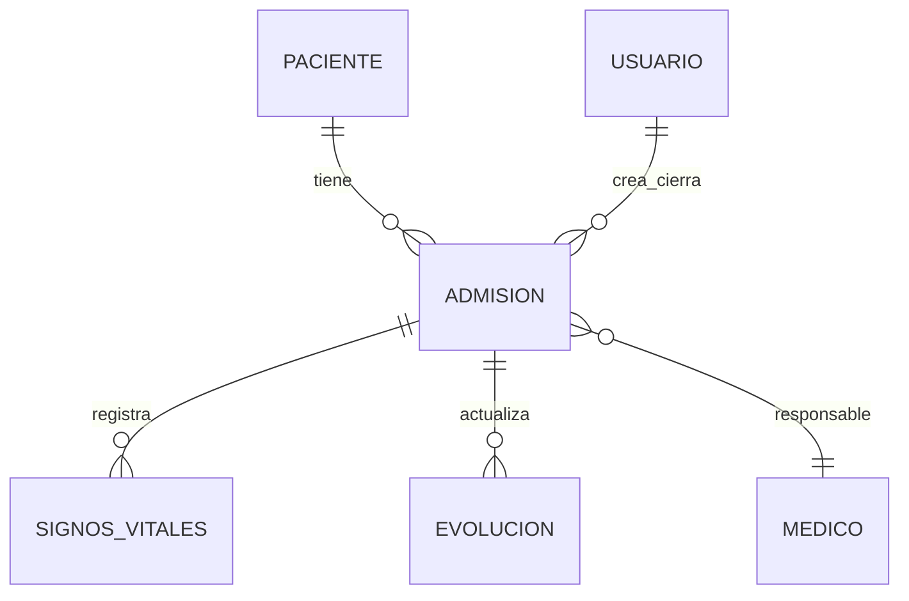

# Documentación de Discovery y Jornada de Usuario – Sistema Hospitalar

**Versión:** Octubre 2025
**Ámbito:** Clínica privada en Perú
**Stack de referencia:** Laravel 12 (PHP 8), MySQL, AdminLTE (Blade), API REST, despliegue en Hostinger

---

## Objetivo del documento

Consolidar los hallazgos del **Discovery** y mapear la **Jornada de Usuario** para alinear decisiones de producto, priorización de MVPs y mejoras de experiencia, en un lenguaje claro para médicos y administradores.

!!! note "Nota"
Este documento está listo para ser colocado en `docs/` y renderizado con MkDocs Material.

---

## 1. Contexto del Discovery

### 1.1 Propósito

* Entender el flujo real de atención desde **admisión** hasta **alta**.
* Identificar **puntos de dolor**, **oportunidades** y **requisitos** por perfil.
* Alinear el **roadmap** (MVP1/MVP2/MVP3) a métricas de eficiencia y calidad asistencial.

### 1.2 Usuarios entrevistados y método

* **Médicos (3)**: medicina general y pediatría; entrevistas semiestructuradas y pruebas guiadas.
* **Recepcionistas (2)**: observación en mostrador y shadowing de admisiones.
* **Enfermería (2)**: registro de signos vitales y flujo de evolución.
* **Administrador (1)**: revisión de reportes, indicadores y cierre de admisiones.
* **Pacientes (4)**: expectativas de comunicación, demoras y visibilidad del proceso.

!!! info "Ejemplo"
El levantamiento se centró en el circuito **Recepción → Triage (Enfermería) → Consulta (Médico) → Alta → Reporte (Administrador)**.

---

## 2. Personas identificadas

| Persona           | Objetivos clave                                                                       | Puntos de dolor                                              | Necesidades funcionales                                                    |
| ----------------- | ------------------------------------------------------------------------------------- | ------------------------------------------------------------ | -------------------------------------------------------------------------- |
| **Médico**        | Acceder rápido a historia clínica y exámenes; prescribir y dar alta con trazabilidad. | Información dispersa; tiempo perdido buscando datos.         | Ficha clínica unificada; prescripción electrónica; evolución estructurada. |
| **Recepcionista** | Registrar pacientes y admisiones sin duplicidad; gestionar citas.                     | Duplicación de datos; difícil localizar admisiones abiertas. | Búsqueda por DNI/nombre; validación automática; flujo guiado.              |
| **Enfermería**    | Registrar signos vitales y notas vinculadas a admisión activa.                        | Formularios en papel; demoras en compartir con médico.       | Formulario digital rápido; vínculo directo a admisión y órdenes.           |
| **Administrador** | Visibilidad de operaciones e ingresos; auditoría.                                     | Reportes manuales y tardíos.                                 | Dashboard con filtros; indicadores en tiempo real; exportación.            |
| **Paciente**      | Atención ágil y transparente; no repetir datos.                                       | Esperas largas; poca visibilidad de su estado.               | Confirmaciones y recordatorios; portal de acceso a información.            |

---

## 3. Jornada de Usuario (de Admisión a Alta)

### 3.1 Flujo macro

1. **Recepción / Admisión**

   * Verificación/registro de datos del paciente.
   * Creación de **admisión** y asignación de médico/servicio.

2. **Triage / Evaluación inicial (Enfermería)**

   * Registro de **signos vitales** y antecedentes/alertas.

3. **Consulta médica**

   * Acceso a historial; diagnóstico; **órdenes** (exámenes/medicación) y **prescripción**.

4. **Seguimiento (Enfermería)**

   * Actualización de **evolución** y administración de medicamentos (si aplica).

5. **Alta médica**

   * Cierre de admisión; **resumen clínico**.

6. **Reporte administrativo**

   * Visualización de **admisiones cerradas**, ingresos y estadísticas.

### 3.2 Estados de una admisión (modelo conceptual)

```yaml
admission_states:
  - OPEN: "Creada por Recepción"
  - TRIAGE: "Signos vitales registrados"
  - IN_CONSULT: "Atención médica en curso"
  - PENDING_ORDERS: "Órdenes/exámenes pendientes"
  - READY_FOR_DISCHARGE: "Criterios de alta cumplidos"
  - CLOSED: "Alta emitida y admisión cerrada"
transitions:
  - OPEN -> TRIAGE
  - TRIAGE -> IN_CONSULT
  - IN_CONSULT -> PENDING_ORDERS | READY_FOR_DISCHARGE
  - PENDING_ORDERS -> READY_FOR_DISCHARGE
  - READY_FOR_DISCHARGE -> CLOSED
```

!!! note "Nota"
Este modelo de estados sirve de guía para pantallas, permisos y notificaciones contextuales por rol.

---

## 4. Puntos de dolor y oportunidades

| Área           | Punto de dolor                           | Impacto | Oportunidad                                                       |
| -------------- | ---------------------------------------- | ------: | ----------------------------------------------------------------- |
| Recepción      | Registro duplicado y errores de admisión |    Alto | Validación por DNI y **búsqueda inteligente** con autocompletado. |
| Médico         | Información clínica dispersa             |    Alto | **Historia clínica unificada** por paciente y admisión.           |
| Enfermería     | Formularios manuales poco legibles       |   Medio | **Digitalización** de signos vitales y notas estructuradas.       |
| Administración | Reportes manuales y tardíos              |    Alto | **Dashboards** con filtros y exportación (PDF/Excel).             |
| Paciente       | Falta de comunicación y transparencia    |   Medio | **Portal de paciente** y **notificaciones** de estado/citas.      |

---

## 5. Mapa “Faz / No Faz”

### 5.1 Lo que el sistema **hace hoy** (MVP1 / MVP2)

* **Pacientes**: registro y gestión básica.
* **Admisiones**: creación, estado activo/cerrado y vínculo con médico.
* **Enfermería**: registro de **signos vitales** y **evolución**.
* **Consulta médica**: acceso a datos de admisión y registro de atención.
* **Administración**: panel con **estadísticas básicas** y **reportes**.
* **Usuarios y roles**: Administrador, Médico, Recepcionista (permisos base).
* **Exportaciones**: PDF y Excel en listados principales.
* **Arquitectura**: Backend API + Frontend (Laravel + AdminLTE con Blade).
* **Despliegue**: entorno local (XAMPP) y **Hostinger** para producción.

!!! info "Ejemplo"
El flujo actual permite: Crear paciente → Crear admisión → Triage → Consulta → Alta → Reporte.

### 5.2 Lo que **aún no hace** y está planificado (hacia MVP3)

* **Portal de paciente** (citas, resultados, comprobantes).
* **Notificaciones automáticas** (correo/SMS) para citas y cambios de estado.
* **Prescripción electrónica** con firma digital/auditoría.
* **Facturación** integrada y conciliación básica.
* **Historia clínica unificada** por paciente (longitudinal).
* **Dashboard médico** (productividad, tiempos de atención).
* **Control de stock** (medicamentos/insumos).
* **Alertas internas** entre áreas (recepción ↔ médico ↔ enfermería).

!!! warning "Advertencia"
Las funcionalidades planificadas requieren definición de **políticas de acceso** y **cumplimiento normativo** (consentimiento informado, auditoría, retención de datos y seguridad).

---

## 6. Recomendaciones de mejora (UX y operación)

1. **Ficha única del paciente** con vista longitudinal (consultas, prescripciones, exámenes y altas).
2. **Flujo guiado de admisión** con validación por DNI y campos obligatorios mínimos.
3. **Trazabilidad visual por etapa** (estado de admisión y responsable actual).
4. **Notificaciones internas** y bandeja de tareas por rol.
5. **Vistas adaptadas a tablet** para enfermería y consulta.
6. **Permisos granulares** por módulo/acción; registro de auditoría.
7. **Indicadores operativos**: tiempo de espera, tiempo de consulta, admisiones por médico, tasa de reingreso.
8. **Portal de paciente** con confirmación, recordatorios y resultados.
9. **Plantillas de evolución y prescripción** para acelerar registros y reducir variabilidad.
10. **Onboarding y ayuda contextual** (tooltips, ejemplos y validaciones en formularios).

---

## 7. Criterios de éxito (KPIs sugeridos)

* **T_espera_promedio** (Recepción → Consulta)
* **T_total_atención** (Admisión → Alta)
* **% admisiones con datos completos** (sin errores/duplicados)
* **% documentación clínica digitalizada** (vs. papel)
* **Satisfacción del paciente (CSAT/NPS)**
* **Uso de paneles y exportaciones** (adopción por rol)

```text
Meta inicial (90 días):
- Reducir T_espera_promedio en 25%.
- Aumentar documentación digital a 80%.
- Elevar CSAT a ≥ 4.3/5.
```

---

## 8. Implicancias técnicas

### 8.1 Modelo de datos (alto nivel)



### 8.2 Permisos mínimos por rol (base)

* **Recepcionista**: CRUD Paciente; Crear/actualizar Admisión; Ver listados.
* **Enfermería**: Ver Admisión; Crear Signos Vitales/Evolución; Ver órdenes.
* **Médico**: Ver/editar Admisión; Diagnóstico; Prescripción; Alta.
* **Administrador**: Acceso a reportes/dashboards; gestión de usuarios/roles.

!!! note "Nota"
La definición granular de permisos y auditoría se ampliará junto a prescripción electrónica y facturación.

---

## 9. Roadmap (orientativo)

* **MVP2 (consolidación)**:

  * Mejoras de usabilidad en admisiones y listados.
  * Exportaciones estables y filtros compuestos.
  * Panel administrativo con KPIs básicos.

* **MVP3 (extensión)**:

  * Portal de paciente + notificaciones.
  * Prescripción electrónica + firma digital.
  * Historia clínica unificada y dashboard médico.
  * Primeras integraciones de facturación/stock.

---

## 10. Riesgos y mitigaciones

| Riesgo                                  | Mitigación                                                             |
| --------------------------------------- | ---------------------------------------------------------------------- |
| Resistencia al cambio (papel → digital) | Capacitación, ayudas contextuales y plantillas.                        |
| Calidad de datos (duplicados/errores)   | Validación por DNI, reglas de negocio y auditoría.                     |
| Performance en listados                 | Indexación, paginación server-side y filtros eficientes.               |
| Seguridad y cumplimiento                | Políticas de roles, logs de auditoría, cifrado en tránsito y respaldo. |

---

## 11. Requisitos abiertos (para definición conjunta)

* Reglas de firma digital y custodia de documentos clínicos.
* Política de retención y acceso a historia clínica.
* Parámetros de notificaciones (canales, frecuencia, contenidos).
* Alcance mínimo de facturación (comprobantes, tarifas, convenios).

---

## 12. Anexos

### 12.1 Pseudoflujo de admisión (recepción)

```pseudo
if buscarPaciente(DNI) == encontrado:
    seleccionarPaciente()
else:
    registrarPacienteMinimo()
admisión = crearAdmisión(paciente, médico, servicio)
mostrarEstado(admisión, "OPEN")
```

### 12.2 Comandos de referencia (entorno local)

```bash
# Levantar entorno local (ejemplo)
php artisan serve

# Ejecutar migraciones y seeds
php artisan migrate --seed
```

!!! info "Ejemplo"
La clínica puede iniciar con módulos activos de **Pacientes, Admisiones, Signos Vitales, Evolución y Reportes** mientras se prepara la extensión a **Portal de Paciente** y **Prescripción**.

---

**Archivo sugerido: docs/04-discovery/Jornadas-y-Mapa-de-Usuario.md**
